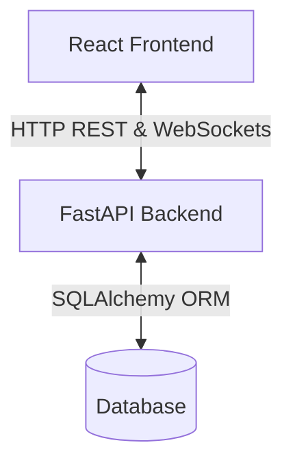
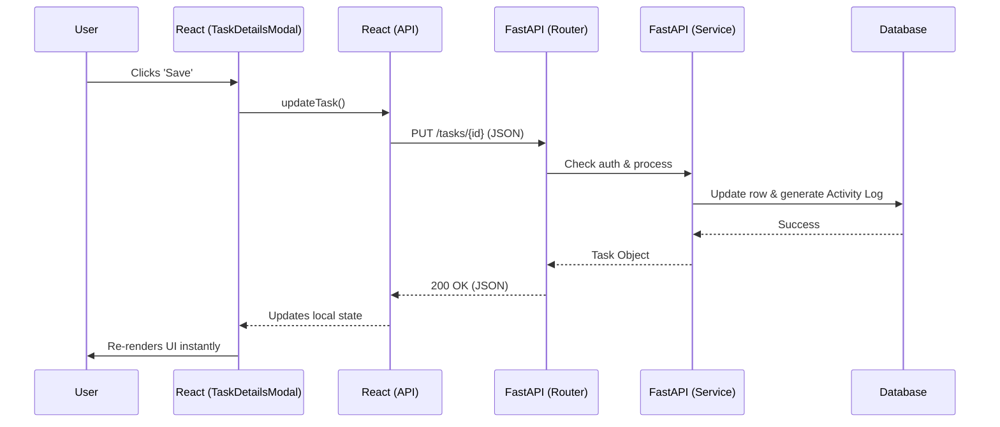

# GETitDONE - Codebase Architecture

> [!NOTE]
> This document explains the internal folder structure, file organization, and modular architecture of the **GETitDONE** application. It details the Tech Stack used and breaks down what each specific file does.

## 🛠 Tech Stack

| Layer | Technologies Used | Description |
|---|---|---|
| **Frontend** | React (Vite), React Router, Context API | Single-page application built with raw CSS for styling. |
| **Backend** | Python, FastAPI, SQLAlchemy | High-performance async backend using Router-Service pattern. |
| **Database** | SQLite (Local) / PostgreSQL (Prod) | Relational database via ORM models. |
| **Real-time** | FastAPI WebSockets | Pushes instant notifications between peers. |

## 🏗 High-Level Architecture



## 📂 Directory Structure

> [!TIP]
> The project is split into two entirely decoupled services. The `frontend/` handles all UI/UX, while the `backend/` handles data validation and storage.

```text
todo-app/
├── frontend/             # The React application (UI)
│   └── src/
│       ├── api/          # HTTP request functions to the backend
│       ├── components/   # Reusable UI components
│       ├── context/      # Global state management
│       ├── pages/        # Full screen page views
│       └── utils/        # Helper functions
├── backend/              # The FastAPI application (Server/Database)
│   ├── routers/          # API endpoint controllers
│   ├── schemas/          # Pydantic data validation models
│   ├── services/         # Core business logic
│   └── models.py         # SQLAlchemy database models
└── ARCHITECTURE.md       # This file!
```

---

## 🖥 Frontend Architecture (`frontend/src/`)

The frontend is a single-page application (SPA). It uses `AppContext` to hold the global state (tasks, peers, Whuffies) so that any component can easily access the data without complex prop drilling.

### `/pages/`
These are the main screen views of the application.
*   [Dashboard.jsx](file:///Users/test/Projects/todo-app/frontend/src/pages/Dashboard.jsx): The core view of the application. It fetches tasks on load, renders the drag-and-drop columns, handles opening the Task Details modal, and contains the logic for creating new tasks.
*   [Dashboard.css](file:///Users/test/Projects/todo-app/frontend/src/pages/Dashboard.css): Styling specifically for the Kanban board and drag-and-drop layout.
*   [LoginPage.jsx](file:///Users/test/Projects/todo-app/frontend/src/pages/LoginPage.jsx) & [SignupPage.jsx](file:///Users/test/Projects/todo-app/frontend/src/pages/SignupPage.jsx): The authentication screens where users enter credentials to receive a JWT token.

### `/context/`
*   [AppContext.jsx](file:///Users/test/Projects/todo-app/frontend/src/context/AppContext.jsx): The central "brain" of the frontend. It holds all the global variables (e.g., `tasks`, `luffies`, `peers`). It also establishes the global WebSocket connection to the backend so the app can receive real-time notifications.

### `/components/`
These are reusable modular UI pieces that are injected into the pages.
*   [TaskCard.jsx](file:///Users/test/Projects/todo-app/frontend/src/components/TaskCard.jsx): The individual card for a task shown in the Kanban columns.
*   [TaskDetailsModal.jsx](file:///Users/test/Projects/todo-app/frontend/src/components/TaskDetailsModal.jsx): The large overlay modal that appears when you click a task. It has a "Read Mode" (for viewing history and duplicating) and an "Edit Mode" (for modifying data).
*   [Sidebar.jsx](file:///Users/test/Projects/todo-app/frontend/src/components/Sidebar.jsx): The left-hand navigation panel that contains the "Next Up" list.
*   [NetworkModal.jsx](file:///Users/test/Projects/todo-app/frontend/src/components/NetworkModal.jsx): The interface where users can search for peers, send requests, and build their network.

### `/api/`
These files act as the "bridge" to the Python backend. They use `fetch()` to send HTTP requests to the FastAPI endpoints.
*   [tasks.js](file:///Users/test/Projects/todo-app/frontend/src/api/tasks.js): Functions like `getTasks()`, `createTask()`, `updateTask()`.
*   [peers.js](file:///Users/test/Projects/todo-app/frontend/src/api/peers.js): Functions like `requestPeer()`, `acceptPeer()`.

---

## ⚙️ Backend Architecture (`backend/`)

> [!IMPORTANT]
> The backend is structured using the **Router-Service** pattern. This means API routes (URLs) are kept separate from the actual business logic, making the code highly modular.

### Core Files
*   [main.py](file:///Users/test/Projects/todo-app/backend/main.py): The entry point. Initializes FastAPI, configures CORS, and registers all routers.
*   [models.py](file:///Users/test/Projects/todo-app/backend/models.py): Defines the SQLAlchemy database tables (`User`, `Task`, `TaskEvent`). This maps Python objects to SQL rows.
*   [database.py](file:///Users/test/Projects/todo-app/backend/database.py): Sets up the database connection and provides a session to the routes.
*   [socket_manager.py](file:///Users/test/Projects/todo-app/backend/socket_manager.py): Manages active WebSocket connections to push real-time notifications.

### `/routers/`
These files define the API endpoints. They receive requests, authenticate the user, and pass data to the services layer.
*   [tasks.py](file:///Users/test/Projects/todo-app/backend/routers/tasks.py): Endpoints like `GET /tasks` or `POST /tasks`.
*   [auth.py](file:///Users/test/Projects/todo-app/backend/routers/auth.py): Endpoints for authentication.
*   [websockets.py](file:///Users/test/Projects/todo-app/backend/routers/websockets.py): The endpoint `ws://.../ws` that the React frontend connects to for real-time updates.

### `/services/`
This is where the heavy lifting and business logic lives.
*   [tasks_service.py](file:///Users/test/Projects/todo-app/backend/services/tasks_service.py): Contains the logic for updating tasks, managing Whuffie transfers upon completion, and generating system activity logs.

---

## 🔄 End-to-End Data Flow (Example: Editing a Task)


